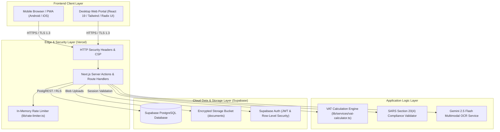
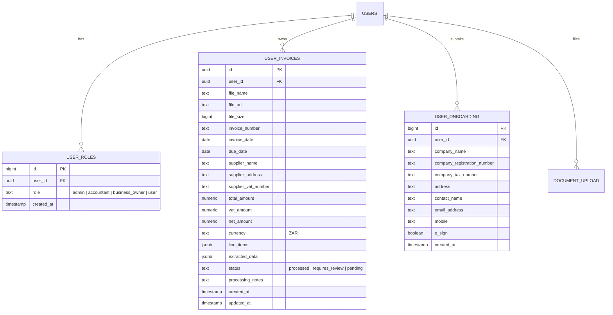

# VATify — Automated VAT Compliance & Document Processing Platform

[](https://github.com/Mckale42/vatify/actions)
[](https://www.vatify.co.za/dashboard)
[](https://nextjs.org)

**Module:** Information Systems 3E — Work Integrated Learning (INSY7315)  
**Qualification:** Bachelor of Computer and Information Science in Application Development (BCAD313/323)  
**Assessment Milestone:** Task 2 — Code and Implementation (70%) & Technical Presentation (20%)  
**Live Application URL:** [https://www.vatify.co.za/dashboard](https://www.vatify.co.za/dashboard)  

---

## 1. Executive Summary & Problem Justification

Small, Medium, and Micro Enterprises (SMMEs) and independent contractors across South Africa face severe administrative friction tracking value-added tax (VAT) receipts, calculating input tax credits, and complying with the **South African Value-Added Tax Act, No. 89 of 1991**. Lost paper slips, mathematical discrepancies, and missing supplier VAT registration numbers lead to denied tax deductions and SARS penalties during audits.

**VATify** addresses this challenge by providing an end-to-end cloud and mobile-first platform that:
1. Captures paper and electronic invoices via device camera or document upload.
2. Extracts critical tax data using multimodal AI (Google Gemini 2.5 Flash).
3. Executes automated arithmetic and SARS Section 20(4) compliance audits.
4. Categorizes expenses into standard-rated (15%), zero-rated (0%), and exempt supplies.
5. Aggregates monthly and bi-monthly VAT 201 preparation reports with real-time analytics.

---

## 2. System Architecture & Technology Rationale

VATify employs a modern **hybrid edge-serverless architecture** combining Next.js 15, PostgreSQL on Supabase Cloud, and Google Generative AI.



### Technology Decision Rationale:
* **Next.js 15 (App Router) & React 19:** Combines server-side rendering (SSR), streaming UI, and API route handlers in a single unified codebase, eliminating CORS overhead between separate API and UI services while maintaining sub-second TTFB.
* **Supabase Cloud (PostgreSQL 15):** Provides enterprise-grade relational ACID compliance, foreign key integrity, row-level security (RLS), and secure object storage for original receipts.
* **Google Gemini 2.5 Flash:** Chosen for state-of-the-art vision extraction from wrinkled, faded, or low-light receipts with sub-3-second latency and exponential backoff retry mechanisms.
* **Vercel Edge Hosting:** Delivers zero-maintenance global CDN distribution with automated HTTPS termination, DDoS protection, and continuous preview deployments.

---

## 3. Database Architecture (Entity Relationship Diagram)

VATify structures data across four core relational tables hosted in PostgreSQL on Supabase Cloud:



---

## 4. Application Security Controls

In adherence to the **OWASP Top 10:2025** guidelines, VATify implements multi-layered security controls:

1. **Content Security Policy (CSP) & Hardened HTTP Headers (`next.config.mjs`):**
   * `Content-Security-Policy`: Restricts script execution to trusted domains, disables framing (`frame-ancestors 'none'`), and blocks untrusted object plugins (`object-src 'none'`).
   * `X-Frame-Options: DENY`: Prevents Clickjacking attacks.
   * `X-Content-Type-Options: nosniff`: Eliminates MIME-sniffing vulnerabilities.
   * `Referrer-Policy: origin-when-cross-origin`: Minimizes confidential URL leakage.
   * `poweredByHeader: false`: Strips `X-Powered-By` technology disclosure headers.
2. **API Rate Limiting (`lib/rate-limiter.ts`):**
   * Implements sliding-window throttling on critical endpoints (`/api/process-invoice` and `/api/save-invoice`) to prevent Denial-of-Service (DoS) and API quota exhaustion.
   * Exceeding requests automatically trigger HTTP `429 Too Many Requests` with standard `Retry-After` headers.
3. **Role-Based Access Control (RBAC):**
   * Access to privileged routes (such as `/dashboard/users`) requires the `admin` role, verified on the server against the `user_roles` database table.
   * Normal users attempting direct navigation are redirected away and denied backend operations.
4. **Data Integrity & SARS Compliance Audits (`lib/services/vat-calculator.ts`):**
   * Mathematical verification enforces:
     $$\text{Net Amount} + \text{VAT Amount} = \text{Total Amount}$$
   * Discrepancies exceeding R0.05 automatically reclassify invoices as `"requires_review"`.
   * Audits supplier VAT numbers to ensure they adhere to SARS formatting (10-digit numeric sequence starting with digit 4).

---

## 5. DevOps, Gitflow & CI/CD Pipeline

### 5.1 Branching Strategy
VATify follows standard **Gitflow**:
* `main`: Production-ready release branch deployed directly to [vatify.co.za](https://www.vatify.co.za).
* `develop`: Integration staging branch for completed feature merges.
* `feature/*`: Dedicated branches for individual modules (`feature/vat-calculation-engine`, `feature/security-headers`, `feature/automated-testing`).

### 5.2 GitHub Actions Automated CI/CD Workflow (`.github/workflows/ci.yml`)
Every code push and pull request triggers an automated three-stage verification pipeline:
1. **Lint & Code Standards:** Runs `npm run lint` with ESLint.
2. **Automated Testing:** Executes the **Vitest** test suite verifying math calculations, compliance logic, rate limiters, and UI components.
3. **Production Build Verification:** Executes `npm run build` with strict TypeScript validation to ensure zero compilation or bundling errors before deployment.

---

## 6. Automated Testing & Verification

VATify includes an automated unit and component testing suite powered by **Vitest** and **React Testing Library**.

### Running Tests Locally:

```bash
# Run the complete automated test suite
npm test

# Run tests in interactive watch mode
npm run test:watch
```

### Test Coverage Highlights:
* `__tests__/vat-calculator.test.ts`:
  * 15% standard rate calculations and 2-decimal rounding.
  * Reverse VAT extraction ($Total / 1.15$).
  * Zero-rated and exempt supply handling.
  * 5-cent arithmetic discrepancy boundary verification.
  * SARS Section 20(4) Tax Invoice mandatory field checks.
* `__tests__/rate-limiter.test.ts`:
  * Threshold allowance under normal load.
  * HTTP 429 rejection when requests exceed the limit.
* `__tests__/mobile-nav.test.tsx`:
  * ARIA accessibility attributes and mobile navigation routing.

---

## 7. Local Development Setup

1. **Clone the repository:**
   ```bash
   git clone https://github.com/Mckale42/vatify.git
   cd vatify
   ```

2. **Install dependencies:**
   ```bash
   npm install
   ```

3. **Configure Environment Variables:**
   Copy `.env.example` to `.env.local`:
   ```bash
   cp .env.example .env.local
   ```
   For offline UI demo mode without credentials, set:
   ```env
   VATIFY_DEMO_MODE=true
   NEXT_PUBLIC_DEMO_MODE=true
   ```
   For live database and Gemini AI execution, set:
   ```env
   VATIFY_DEMO_MODE=false
   NEXT_PUBLIC_DEMO_MODE=false
   NEXT_PUBLIC_SUPABASE_URL=https://your-project.supabase.co
   NEXT_PUBLIC_SUPABASE_ANON_KEY=your-supabase-anon-key
   GEMINI_API_KEY=your-gemini-api-key
   ```

4. **Launch development server:**
   ```bash
   npm run dev
   ```
   Navigate to [http://localhost:3000/dashboard](http://localhost:3000/dashboard).

---

## 8. Task 2 Presentation Talking Points (Annexure D Alignment)

When presenting to your lecturer and WIL Coordinator:
1. **Technical Demo:** Showcase the live site at `https://www.vatify.co.za/dashboard`, trigger an invoice photo capture, show real-time extraction, and demonstrate the dynamic VAT 201 totals.
2. **Architecture Defense:** Explain the choice of Next.js 15 for sub-second rendering, Supabase PostgreSQL for relational data integrity, and Gemini AI for OCR resilience.
3. **Security Justification:** Highlight the strict CSP headers, in-memory rate limiting against API abuse, and database-backed RBAC on `/dashboard/users`.
4. **DevOps & Quality Assurance:** Present the passing Vitest test suite and show the GitHub Actions workflow executing automatically on merge.
